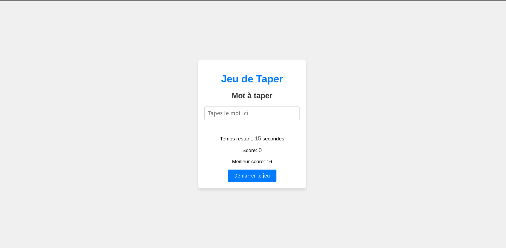

# Test de Rapidité d'Écriture

Ce projet est un jeu de rapidité d'écriture où les utilisateurs doivent taper des mots le plus rapidement possible avant la fin du temps imparti.

## Fonctionnalités

- Affichage d'un mot aléatoire à taper
- Saisie utilisateur pour taper le mot affiché
- Compte à rebours de 15 secondes
- Calcul du score basé sur le nombre de mots correctement tapés
- Sauvegarde du meilleur score dans le localStorage

## Structure du projet

- `index.html` : Le fichier HTML principal qui contient la structure de la page.
- `style.css` : Le fichier CSS pour le style de la page.
- `script.js` : Le fichier JavaScript contenant la logique du jeu.
- `README.md` : Ce fichier, décrivant le projet.

## Comment démarrer le jeu

1. Ouvrez le fichier `index.html` dans votre navigateur.
2. Cliquez sur le bouton "Démarrer le jeu".
3. Tapez les mots affichés dans le champ de saisie avant la fin du temps imparti.

## Démonstration

## Technologies utilisées

- HTML
- CSS
- JavaScript

## Auteur

- **Lechassles Antoine** - [Votre Profil GitHub](https://github.com/https://github.com/AlphaSaiiko)
